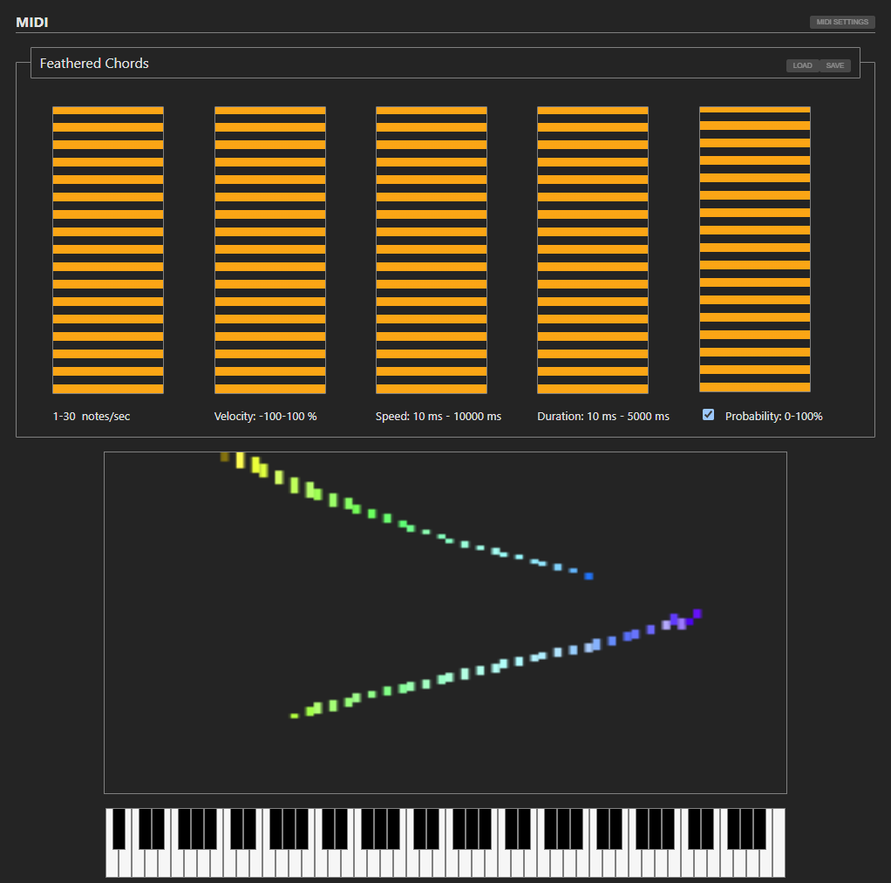

# MIDI Feathered Chords

A web app to feather notes played over any and all MIDI inputs, outputting to a device of your choice.

Similar to [the Seldon Black software Bear McCreary used for the Foundation soundtrack](https://www.youtube.com/watch?v=x7jk0uAB9XY&t=95s), though developed independently and originally producing notes via L-systems. I do not watch a lot of television, and loved the Asmiov books when I read them 40-odd years ago, so it took me a while to even hear of the Foundation series, let alone watch it. Must do better.

To help with loopback, input and output channels can be different.

Settings can be saved and restored through the Load and Save buttons.

Contains some novelty visualisations.

[Demo](https://leegee.github.io/webapp-midi-feathered) requires a [Web MIDI API](https://caniuse.com/midi) connection, not a MIDI-over-USB connection.

### Installation

    bun install

### Run/Dev
    
    bun run dev

### About

A small application using Vite, React, Jotai, Web MIDI, mainly to compare React/Jotai to Vue3/Pinia. 

### To Do

* Support sustain pedal

